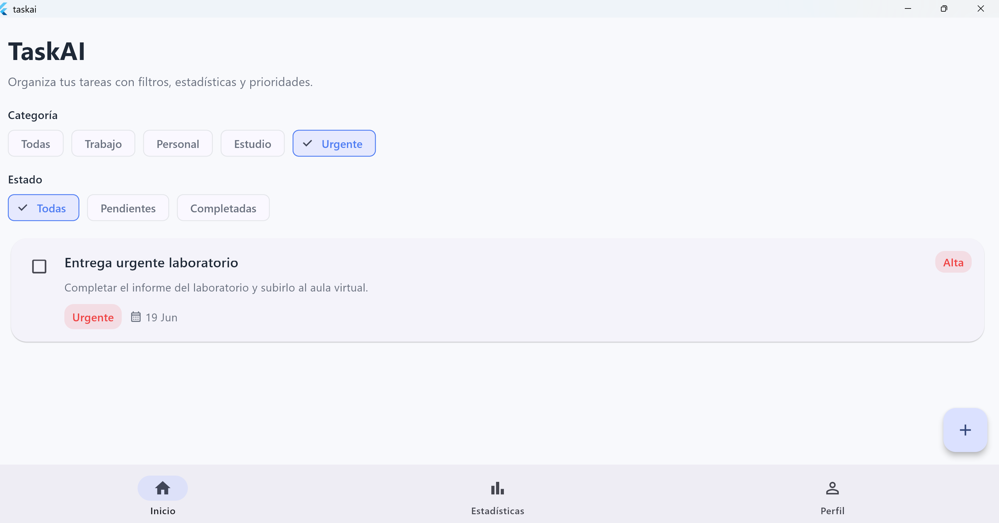
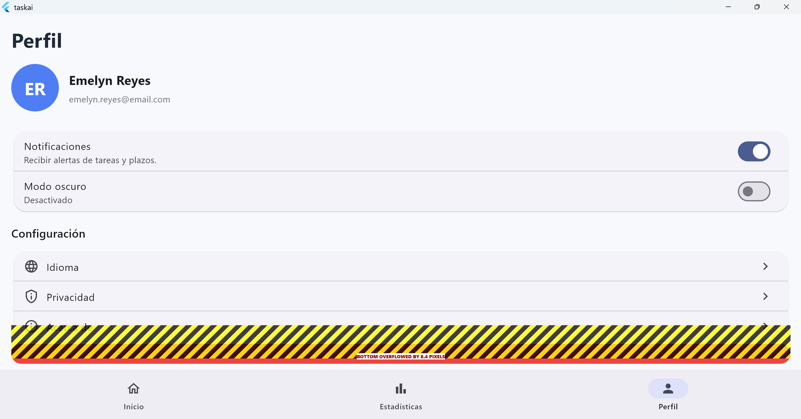
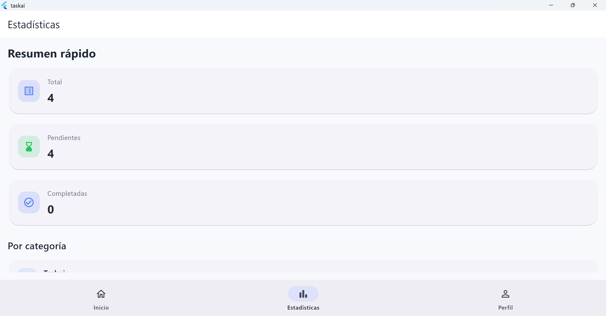

# TaskAI v1.0

TaskAI es una aplicación de gestión de tareas desarrollada en Flutter para una asignación universitaria. La app ofrece creación, edición, eliminación y filtrado de tareas con estadísticas integradas, navegación moderna y diseño Material 3.

## Características

- CRUD completo de tareas en memoria con Provider.
- Filtros por categoría y estado.
- Estadísticas de tareas totales, pendientes, completadas y por categoría.
- Pantalla de perfil con modo oscuro.
- Navegación inferior con `NavigationBar`.
- Interfaz minimalista y moderna con Material Design 3.

## Tecnologías

- Flutter 3.38+
- Dart 3.x
- Provider
- go_router
- Material Design 3

## Requisitos previos

- Flutter instalado y configurado en tu sistema.
- Si vas a compilar en Windows, instala Visual Studio con componentes de escritorio para C++.
- Para Android, configura un emulador o conecta un dispositivo físico.

## Instalación

1. Clona el repositorio y entra en la carpeta del proyecto:

```bash
git clone https://github.com/Emelyn03/taskai.git
cd taskai
```

2. Descarga las dependencias:

```bash
flutter pub get
```

## Ejecución

- Ejecutar en el dispositivo predeterminado:

```bash
flutter run
```

- Ejecutar en Windows:

```bash
flutter run -d windows
```

- Ejecutar en un emulador Android:

```bash
flutter emulators --launch <emulator_id>
flutter run
```

## Build de release

- Android APK:

```bash
flutter build apk --release
```

- Windows release:

```bash
flutter build windows --release
```

## Estructura del proyecto

- `lib/main.dart`: punto de entrada de la aplicación.
- `lib/models/task.dart`: modelo de datos de tareas.
- `lib/providers/task_provider.dart`: estado de tareas en memoria.
- `lib/providers/theme_provider.dart`: manejo de tema claro/oscuro.
- `lib/routes/app_router.dart`: configuración de rutas con go_router.
- `lib/screens/home_screen.dart`: pantalla principal con lista y filtros.
- `lib/screens/task_form_screen.dart`: formulario para crear y editar tareas.
- `lib/screens/statistics_screen.dart`: pantalla de estadísticas.
- `lib/screens/profile_screen.dart`: pantalla de perfil.
- `lib/widgets/task_card.dart`: tarjeta de tarea.
- `lib/widgets/filter_bar.dart`: filtros con chips.
- `lib/widgets/category_chip.dart`: chips de categoría.
- `lib/widgets/statistics_card.dart`: tarjetas de estadísticas.

## Datos de demostración

La aplicación carga tareas de ejemplo automáticamente para mostrar la funcionalidad de CRUD, filtros y estadísticas.

## Capturas de pantalla

### Pantalla principal


### Estadísticas


### Perfil


## Notas

- No usa Firebase ni base de datos externa.
- Todos los datos se mantienen en memoria.
- No hay integración con APIs externas ni IA.
